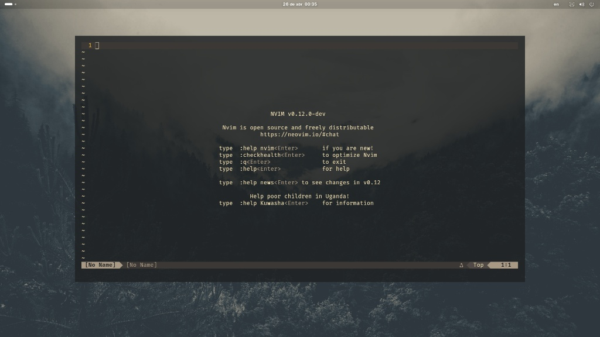
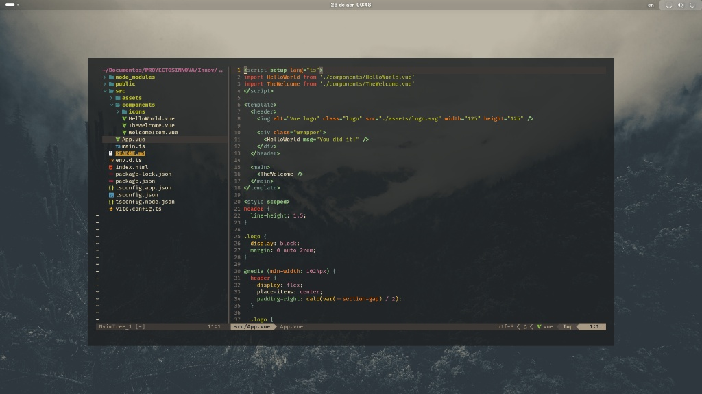
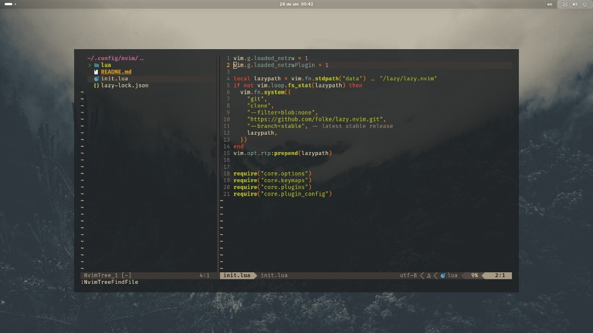

# Neovim Configuration

A personalized Neovim setup using [Lazy.nvim](https://github.com/folke/lazy.nvim) as the plugin manager, focused on providing a productive development environment with modern features.

## Preview

## Features

### Core Enhancements
- **Leader Key**: Spacebar (`<SPACE>`) as leader
- **Window Navigation**: Intuitive Ctrl+h/j/k/l for pane movement
- **Search**: Leader+h to clear search highlights
- **UI Improvements**: 
  - True color support (termguicolors)
  - Gruvbox theme with transparent background
  - Line numbers and cursor line highlighting
  - Lualine status bar
  - Tab to spaces conversion (2 spaces)

### Editing Productivity
- **Comments**: Easy commenting with `gc` (vim-commentary)
- **Surroundings**: Modify surroundings with `ys`, `cs`, `ds` (vim-surround)
- **Emmet**: HTML/CSS abbreviations (emmet-vim)
- **File Operations**: 
  - Oil.nvim for intuitive file editing (:Oil)
  - Nvim-tree for file explorer (configurable)
- **Markdown**: Live preview (markdown-preview.nvim)

### Development Tools
- **LSP Support**: 
  - Mason for LSP/DAP/linter installation
  - nvim-lspconfig with language-specific configs
  - Completion via nvim-cmp with LuaSnip
  - Rust-specific configuration
- **Git Integration**: 
  - Fugitive for Git commands
  - Gitsigns for gutter signs
- **Testing**: vim-test integration
- **Terminal**: Vimux for tmux integration
- **Navigation**: 
  - Telescope for fuzzy finding
  - tmux-navigator for seamless tmux/Vim movement
- **Code Understanding**: 
  - Treesitter for improved syntax highlighting
  - Swagger API preview

### Supported Languages
- General LSP support via mason-lspconfig
- Specific configurations for Rust
- Web development (HTML/CSS/JS via emmet and LSP)

## Plugins

A complete list of plugins can be found in [lua/core/plugins.lua](./lua/core/plugins.lua), organized by category:

- **Themes**: gruvbox, catppuccin, dracula
- **UI**: lualine, telescope, nvim-tree, nvim-web-devicons
- **Editing**: vim-commentary, vim-surround, emmet-vim
- **File Management**: oil.nvim, nvim-tree.lua
- **LSP & Completion**: 
  - nvim-lspconfig, mason.nvim, mason-lspconfig.nvim
  - nvim-cmp, LuaSnip, friendly-snippets
  - cmp-nvim-lsp, cmp_luasnip
- **Git**: tpope/vim-fugitive, lewis6991/gitsigns.nvim
- **Development**: 
  - vim-test, preservim/vimux
  - christoomey/vim-tmux-navigator
  - stevearc/oil.nvim
  - github/copilot.vim
  - williamboman/mason.nvim
  - neovim/nvim-lspconfig
- **Preview Tools**: 
  - swagger-preview.nvim
  - iamcco/markdown-preview.nvim
- **Syntax**: nvim-treesitter/nvim-treesitter

## Configuration

All settings are modularly organized in `lua/core/`:
- `options.lua`: Editor settings (tabs, line numbers, etc.)
- `keymaps.lua`: Key mappings and leader configuration
- `plugins.lua`: Plugin specifications for Lazy.nvim
- `plugin_config/`: Individual plugin configurations:
  - colorscheme.lua: Gruvbox setup with transparency
  - completions.lua: nvim-cmp configuration
  - copilot.lua: GitHub Copilot integration
  - lsp_config.lua: LSP server configurations
  - lualine.lua: Status bar setup
  - nvimtree_config.lua: File explorer settings
  - treesitter.lua: Syntax highlighting configuration
  - And others for specific plugins

## Installation

Since this is already configured in `~/.config/nvim`, simply ensure you have:
- Neovim >= 0.8.0
- Git
- A Nerd Font (for proper icon display in plugins like nvim-tree and lualine)

Plugins will be automatically installed by Lazy.nvim on first launch.

## Keybindings

### Navigation
- `<C-h>`, `<C-j>`, `<C-k>`, `<C-l>`: Move between split windows
- `<Leader>h`: Clear search highlights

*(Additional keybindings are defined in lua/core/keymaps.lua and individual plugin configs)*

- **Lazy-lock.json**: Do not delete the `lazy-lock.json` file in the root of this configuration. This file is generated by Lazy.nvim to track the exact versions of plugins installed. Deleting it may cause plugins to be reinstalled or updated to unintended versions, potentially breaking the setup.

Feel free to customize this configuration to your workflow!

## Notes

- Transparent background requires a terminal that supports true colors
- Leader key is set to Spacebar
- Clipboard integration uses system clipboard where available
- Swagger preview requires `swagger-ui-watcher` installed globally
- Markdown preview requires Node.js and npm
